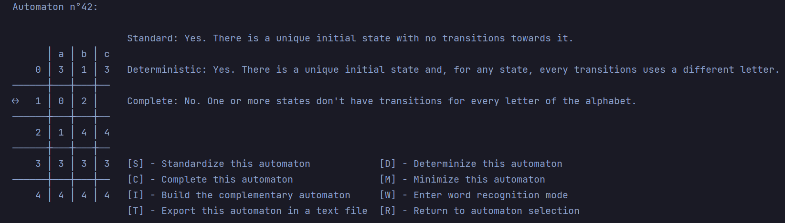

# Finite Automata Toolbox

Produced for the SM402I - "Finite Automata & Regular Expressions" course at EFREI engineering school.

## Our team
We are L2-INT2's group 2, and our members are Enora L'Azou, Elise Morana, Arnaud Van Eeckhoven and Elodie Duflaut. You 
can view our GitHub repository [here](https://github.com/El0o/Finite_Automata_Project).

## Prerequisites

The installation of the [texttable library](https://pypi.org/project/texttable/) is required to launch the program.
> Depending on where you launch the program, you can either type `pip install texttable` on cmd (for Windows users) 
or use your IDE's package management system to install it.

## Usage

You just have to launch [main.py](main.py) to access the application. Then, follow the indications of the program
to navigate through it.

### Main Menu
That's where you start when you launch the program. From here, you can select any automaton that has been stored inside 
the automata folder. Type the wanted automata's ID to access it. 

You can also type `q` (or `Q`) to quit the program (the input is not case-sensitive), or type in `reset` to reset the
content of the automata folder. It will then be only composed of the 44 tests automata that were given to us for this 
project. 

Once the automaton selected, you enter the Automaton Menu.

### Automaton Menu
Here, you can see something like this :

On the left id displayed the table of transitions of the automaton, with initial and final states represented as arrows,
and at its right indications about the automaton's characteristics. Right underneath are your options from there. Type in 
the letter indicated between the brackets to do the desired action.

#### Options `[S]`, `[D]`, `[C]` and `[M]`
These four actions allow you to get a standardized, determinized, completed and/or minimized version of the automaton. 
If the automaton is not already like it, it will show you the transformed version of this automaton alongside the menu.
You can then either act on that transformed automaton, return to the pre-transformed one or return to the Main Menu.
> The transformed automaton as for ID the number of the original automaton plus "S", "D", "C" or "M" (or a combination 
> of those). For exemple, the complete version of automaton n°42 will be automaton n°42C.

#### Option `[I]`
Does the same thing as above, but builds the automaton accepting the complementary language. The generated automaton will
have the suffix "I".

#### Option `[W]`
Enters word recognition mode. From there, you can type any word and see if the word is recognised or not by the automaton.
Type in `/end` to exit.

#### Option `[T]`
Will, if it does not already exist, save the current automaton as a text file inside the automata folder.
> When you exit the current automaton, the program will automatically detect if you haven't saved it already, and will ask
> you if you want to save it.

#### Option `[R]` and `[P]`
Returns respectfully to the main menu or to the previously displayed automaton.

## License

This program is for an educational purpose only. As the property of the members of the teams, any changes or reproductions
must be agreed with at least one member of the team.